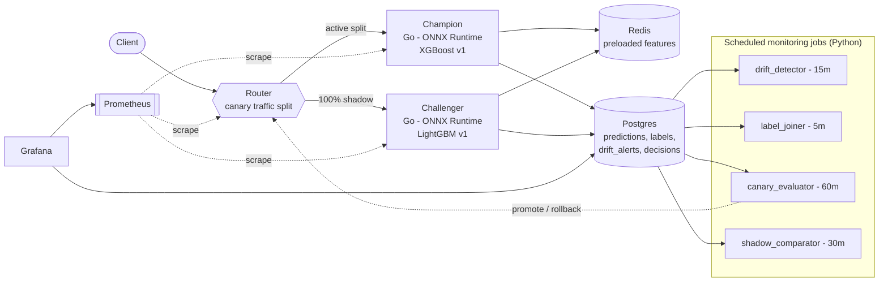
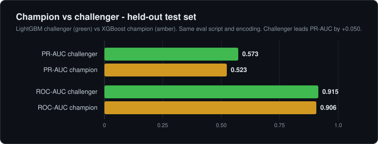
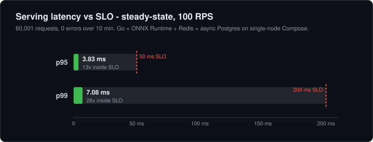
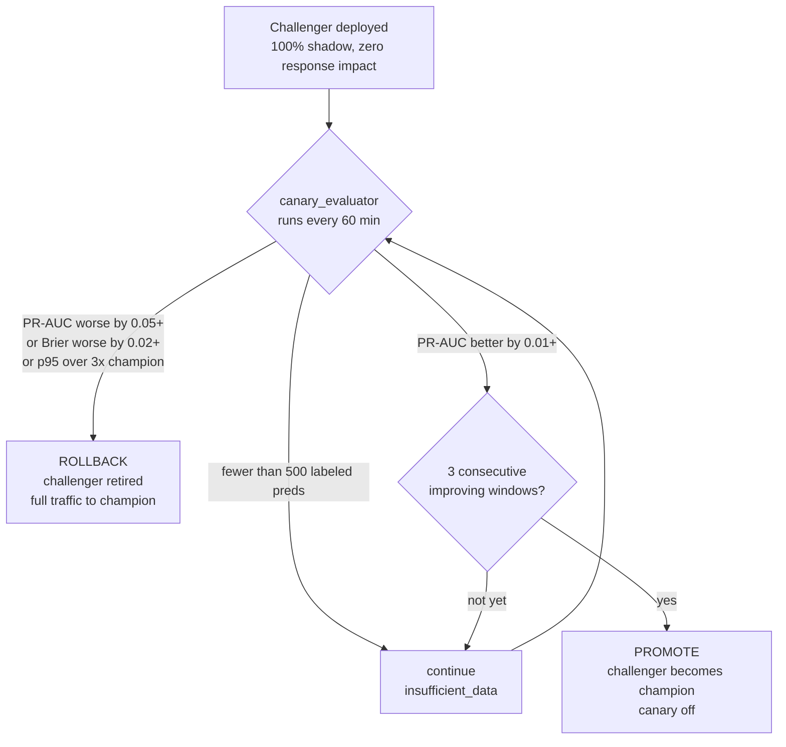

<div align="center">

# Fraud ML Platform

Production fraud-detection system, not just a trained model: ONNX inference in Go, a canary router with automated rollback, drift detection on rolling prediction windows, and a late-label evaluation loop that simulates the delay between a transaction and its fraud label.

[](https://github.com/danielhansenjones/fraud_ml_platform/actions/workflows/ci.yml)
[](#results)
[](#results)
[](#results)

[](pyproject.toml)
[](router/go.mod)
[](#results)
[](#results)
[](PRODUCTION.md)
[](docker-compose.yml)
[](docker-compose.yml)
[](prometheus/)
[](grafana/)
[](load/)
[](docker-compose.yml)

Most ML portfolio projects stop at model training. This one builds the production system around the model.

The XGBoost champion scores PR-AUC 0.523 on the held-out test set. A LightGBM challenger scores 0.592 on the same split and runs behind the router on 100% shadow traffic while the canary evaluator decides whether to promote it.

</div>

## Architecture



Every request hits the router, which forwards to the champion or challenger based on the active traffic split. Both model services pull features from Redis and write predictions to Postgres asynchronously. Four Python jobs run as scheduled containers off the prediction and label tables. No Kafka, no model registry framework, no Kubernetes - the `models` table is the registry and Docker Compose is the orchestrator. The rationale for each omission is in [PRODUCTION.md](PRODUCTION.md).

## Results

<p align="center"></p>

<p align="center"></p>

### Champion vs challenger (held-out test set)

Same evaluation script, same NaN policy, same categorical encoding applied to test using train-time mappings. One protocol difference: the challenger is refit on train plus the validation window before export, the champion artifact is not. That recency edge is part of what a challenger deployment tests. Both decision thresholds are picked on validation data, never test.

| Model                       | PR-AUC    | ROC-AUC   |
|-----------------------------|-----------|-----------|
| XGBoost tuned (champion)    | 0.523     | 0.906     |
| LightGBM tuned (challenger) | **0.592** | **0.920** |

At a ~3.5% fraud base rate a random classifier scores PR-AUC ~0.035, so the champion's 0.523 is roughly a 15x lift and the challenger's 0.592 about 17x. The challenger beats the champion on test PR-AUC by 0.069 and ROC-AUC by 0.014; Brier is within 0.0003. This is the canary system's actual job: shadow it on live traffic and let the evaluator decide whether the advantage holds across multiple windows before promoting.

### Baselines (5-fold purged time-series CV, train set only)

| Model                       | PR-AUC | ROC-AUC | Notes                          |
|-----------------------------|--------|---------|--------------------------------|
| Logistic Regression         | 0.271  | 0.807   | 100k stratified subsample      |
| Random Forest               | 0.404  | 0.836   | 100k stratified subsample      |
| LightGBM baseline           | 0.532  | 0.880   | full train, native NaN         |
| XGBoost untuned             | 0.539  | 0.890   | full train, native NaN         |

LR and RF use a 100k stratified subsample to keep the baseline sweep within a fixed time budget; LightGBM and XGBoost run on the full train set.

### Load tests

Single dev machine (AMD Ryzen 9 9950X3D, 32 threads, 30GiB RAM). The breakdown ramp pushes until the SLO breaks; the failure-injection test pauses the champion mid-stream and watches the rollback path.

| Load test                          | p95     | Error rate | Result                              |
|------------------------------------|---------|------------|-------------------------------------|
| Steady-state 100 RPS, 10 min       | 3.83ms  | 0.00%      | pass                                |
| Breakdown ramp, peak ~1100 RPS     | 64ms    | 5.30%      | cliff at ~1000 RPS, ONNX-CPU bound  |
| Champion paused 30s at 100 RPS     | -       | 9.95%      | pass (SLO under 10%)                |

Cliff is the champion's ONNX inference, not the router or feature store. At the cliff the champion container is using ~30 cores of the host; router stays under 10% CPU and Redis under 2%. Latency degrades gracefully through the cliff (p95 stays under the 200ms SLO); failures are hard 503s rather than ctx timeouts. Detailed methodology and per-component diagnosis in [load/README.md](load/README.md).

## The Interesting Parts

**Temporal correctness in training.** Standard k-fold CV leaks future data into training folds on a time-ordered dataset. I used purged time-series splits and ran adversarial validation to identify the features driving distribution shift between train and test, then pruned them before training.

**ONNX parity across a language boundary.** The Go serving layer loads an ONNX model exported from Python and runs inference via ONNX Runtime. XGBoost exports agree to within 6e-7 (0.00006 percentage points of probability). LightGBM via onnxmltools required stripping ZipMap output nodes, removing a non-standard `nodes_hitrates` attribute, and patching the opset import before ORT 1.20.1 would accept the graph. The resulting max diff is 3.4e-4 - acceptable for any fraud flag threshold.

**Calibration negative result.** Isotonic calibration fit on the most recent validation window did not improve Brier on the held-out test set and slightly degraded PR-AUC. The step function collapses ranges of scores into ties, which loses ranking information when the test distribution sits on different breakpoints than the validation window the calibrator was fit on. The uncalibrated model is served.

### Safe model rollout

The challenger receives 100% shadow traffic from the moment it is deployed, with zero impact on responses. The canary evaluator scores both models on labeled predictions, applies PR-AUC and Brier guardrails, and promotes after 3 consecutive improving evaluation windows. A single bad window triggers rollback at the next hourly evaluation; with the 500-labeled-prediction minimum this is a model-quality gate operating on a scale of hours, not an availability circuit breaker.



## Stack

Python, Go, Redis, Postgres, ONNX Runtime, Prometheus, Grafana, k6, Docker Compose.

## Caveats

- The majority of the features are anonymized Vesta fields. SHAP identifies which ones matter; understanding why requires their private feature dictionary.
- The label simulator captures the delay structure of real fraud labels (log-normal, ~1 day median) but not the real arrival process: no chargeback processing bursts, no label flipping, no manual review queues.
- Load test numbers are from a single developer machine. They confirm the system handles the stated load, not production capacity.

## How to Run

Training data is the [IEEE-CIS Fraud Detection](https://www.kaggle.com/competitions/ieee-fraud-detection) dataset, not included in this repo. Download it with the [Kaggle CLI](https://github.com/Kaggle/kaggle-api) (requires a Kaggle account and accepting the competition rules):

```bash
kaggle competitions download -c ieee-fraud-detection
unzip ieee-fraud-detection.zip -d data/ieee_cis/
```

```bash
uv sync
cp .env.example .env  # edit CHAMPION_VERSION / CHALLENGER_VERSION after monitoring setup

# Phase 1: train and serve
docker compose up -d redis postgres
uv run python main.py            # runs training pipeline through load_features_to_redis
docker compose up --build

# Phase 2 monitoring: challenger model, router, drift/label/canary/shadow jobs
# (the challenger Optuna search dominates wall time on first run; reusing the
# saved study on subsequent runs is fast.)
uv run python monitoring/main.py
# edit .env: set REFERENCE_WINDOW_START/END and CHAMPION/CHALLENGER_VERSION
docker compose --profile monitoring up --build -d
```

See [PRODUCTION.md](PRODUCTION.md) for the full architecture, drift methodology, canary walkthrough, ONNX negative result, and load test results.
